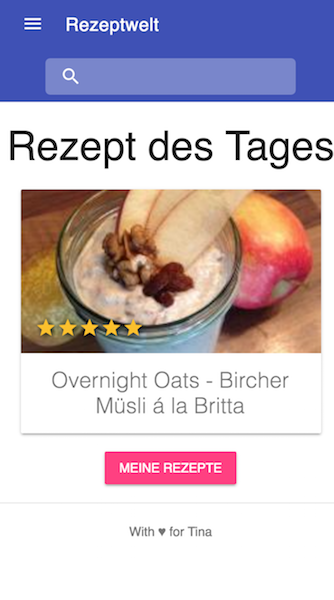
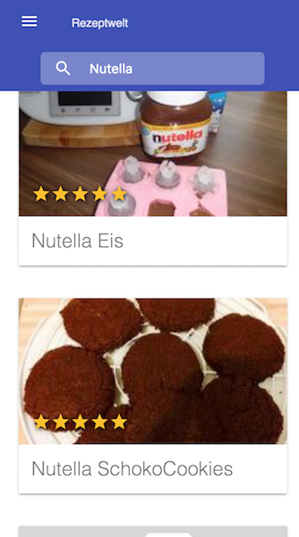
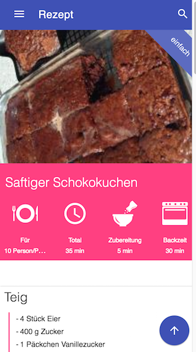
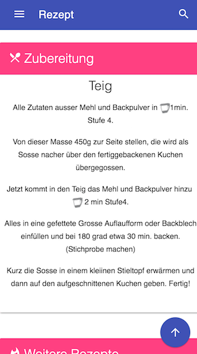
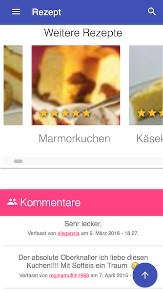
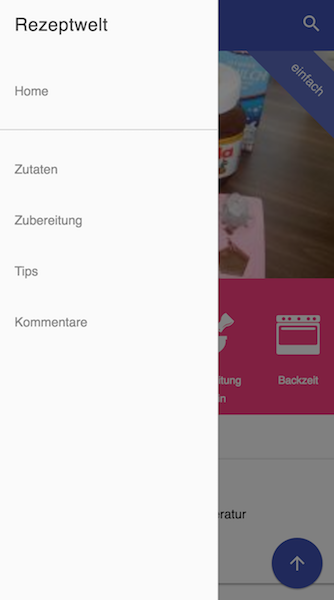
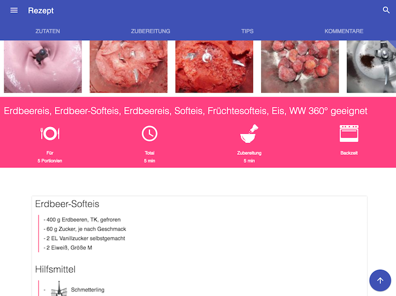

#  RezeptweltWrapper - a responsive Rezepwelt.de Wrapper

A small responsive wrapper that parse recipes from Rezeptwelt.de.
Optimized for mobile devices and tablets.

  


## Features
----
* Responsive Design optimized for mobile
* Nice UI built with Material Design Lite (getmdl.io)
* recipe of the day on homescreen
* Search thru the recipes 
* Cleaned up recipe details

## Screenshots







## Tech

RezeptweltWrapper uses

* [Angular2 RC4](https://angular.io)
* [Material Design](https://getmdl.io)
* [SCSS](http://sass-lang.com)
* [jQuery](http://jquery.com)
* [Gulp](http://gulpjs.com)
* [WebPack](https://github.com/webpack/webpack)

## Installation
----
No PHP or NodeJS needed.


* Just download and extract the files.

* Install the dependencies and devDependencies and start the server.

```sh
$ npm install
$ npm start
```

Here you go.


## ToDo / Plans
----
* Upgrade Angular2 to RC5
* Better error handling if request fails
* Better pagination control
* Gulp Tasks for development and production
* Native Wrapper for iOS/Android

## Background
----
My wife got a new [Thermomix](http://thermomix.vorwerk.de/). Rezeptwelt.de is a german site where you can find many recipes provided by users. So my wife started to look for some recipes on her iPhone. Unfortunately this site is not optimized for mobile devices nor responsive. When I saw her, looking up for a recipe stumbling zooming in and out, the first thing I thought was - man this could be done better. So I started to write some code (in fact I also wanted to get familiar with the Angular 2 Framework). This is what came out.


## License

MIT

----
[Thermomix](http://thermomix.vorwerk.de/) is a trademark by Vorwerk.